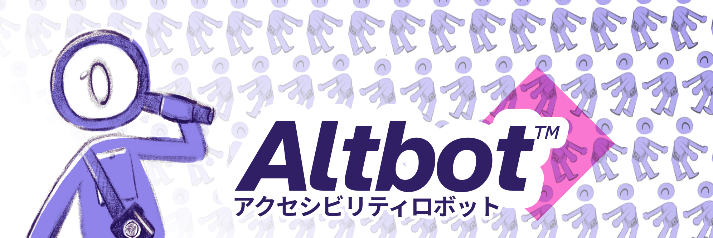

<div align="center">
  

# Altbot™ アクセシビリティロボット

_Making the Fediverse more inclusive, one image at a time_

[](https://github.com/micr0-dev/Altbot/releases)
[](https://fuzzies.wtf/@altbot)
[](https://owl-license.org/)
[](https://go.dev/)


</div>

## About

Altbot™ is an open-source accessibility bot designed to enhance the Fediverse by generating alt-text descriptions for images, video, and audio. This helps make content more accessible to users with visual impairments.

## Privacy & GDPR Compliance

**Altbot™ 2.0 now processes everything 100% locally with zero data retention!** [](https://fuzzies.wtf/@altbot)

In compliance with GDPR, Altbot™ requires explicit informed consent before processing any user requests. When you interact with Altbot™ for the first time, you'll receive a consent request with information about data collection practices and a link to our [Privacy Policy](PRIVACY.md).

- **What we collect:** Request timestamps, processing times, language preferences, media type
- **What we don't collect:** Images, personal information, content of your posts
- **How to revoke consent:** Simply block the bot account

Your post content is never saved or shared. Only images without existing alt-text will be processed, and all processing happens privately on our local server.

## Disclaimer

Alt-texts are generated using a Large Language Model (LLM). While we strive for accuracy, results may sometimes be factually incorrect. Always double-check the alt-text before using it.

## How It Works

Altbot™ listens for mentions and follows on Mastodon. When it detects a mention or a new post from a followed user, it checks for images without alt-text. If it finds any, it uses a Large Language Model (LLM) to generate descriptive alt-text and replies with the generated text.

### Features

- **Mention-Based Alt-Text Generation:** Mention @Altbot in a reply to any post containing an image, video, or audio, and Altbot™ will generate an alt-text description for it.
- **Automatic Alt-Text for Followers:** Follow @Altbot, and it will monitor your posts. If you post an image, video, or audio without alt-text, Altbot™ will automatically generate one for you.
- **Local LLM Support:** Use local LLMs via Ollama for generating alt-text descriptions.
- **GDPR Compliance:** Explicit informed consent system that requires users to provide consent before processing their requests, with clear information about data usage.
- **Consent Requests:** Ask for consent from the original poster before generating alt-text when mentioned by non-OP users.
- **Configurable Settings:** Easily configure the bot using a TOML file.

## Setup

### Standard

1. Clone the repository:

   ```sh
   git clone https://github.com/micr0-dev/Altbot.git
   cd Altbot
   ```

2. Run the setup wizard:

   ```sh
   go run .
   ```

   The setup wizard will guide you through configuring the essential values required for the bot, including:

   - Your Mastodon server URL, client secret, access token, and bot username.
   - The admin contact handle for moderation notifications.
   - Enabling optional features like metrics and alt-text reminders.

   Alternatively, copy the example configuration file and edit it manually:

   ```sh
   cp example.config.toml config.toml
   ```

3. Run the bot:
   ```sh
   go run .
   ```

### Docker

1. Clone the repository:

   ```sh
   git clone https://github.com/micr0-dev/Altbot.git
   cd Altbot
   ```

2. Run the setup wizard:

   ```sh
   docker run -it -v ./:/data --rm ghcr.io/micr0-dev/altbot:latest
   ```

   The setup wizard will guide you through configuring the essential values required for the bot, including:

   - Your Mastodon server URL, client secret, access token, and bot username.
   - The admin contact handle for moderation notifications.
   - Enabling optional features like metrics and alt-text reminders.

   Alternatively, copy the example configuration file and edit it manually:

   ```sh
   cp example.config.toml config.toml
   ```

3. Run the bot:
   ```sh
   docker compose up -d
   ```

## Contributing

We welcome contributions! Please open an issue or submit a pull request with your improvements.

## Trademark Notice

"Altbot" is an unregistered trademark. While the code is open source under the OWL license, the name "Altbot" is protected. If you deploy your own instance, please refer to our [Trademark Policy](TRADEMARK.md) for naming guidelines.

## License

This project is licensed under the [OVERWORKED LICENSE (OWL) v2.0.](https://owl-license.org/) See the [LICENSE](LICENSE) file for details.

---

Join us in making the Fediverse a more inclusive place for everyone!
